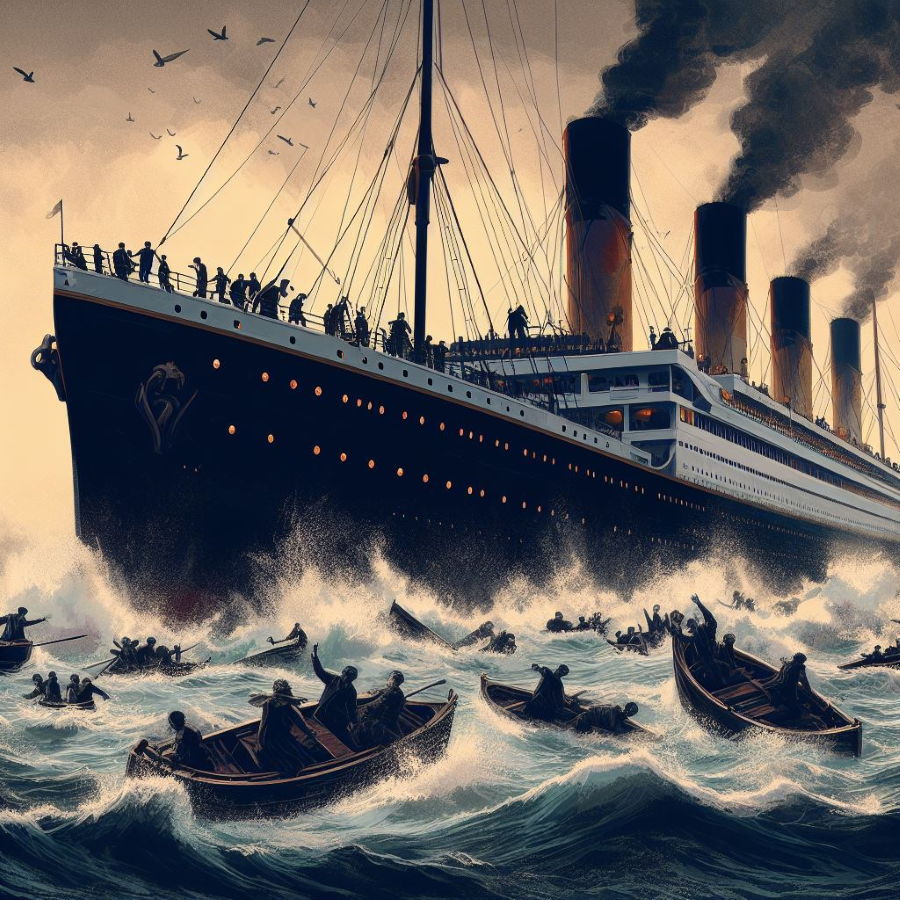
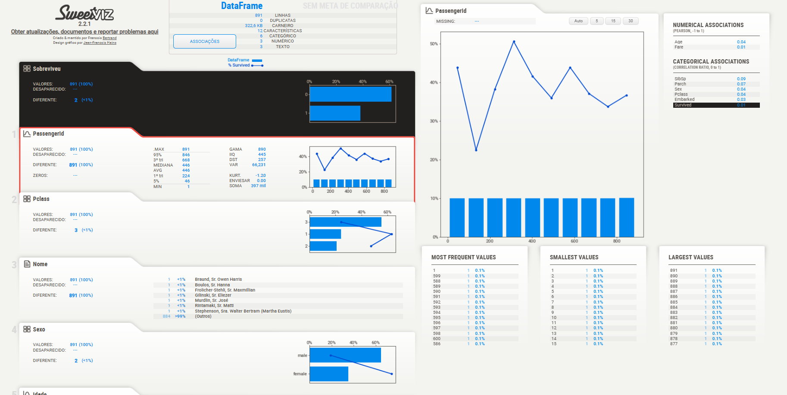
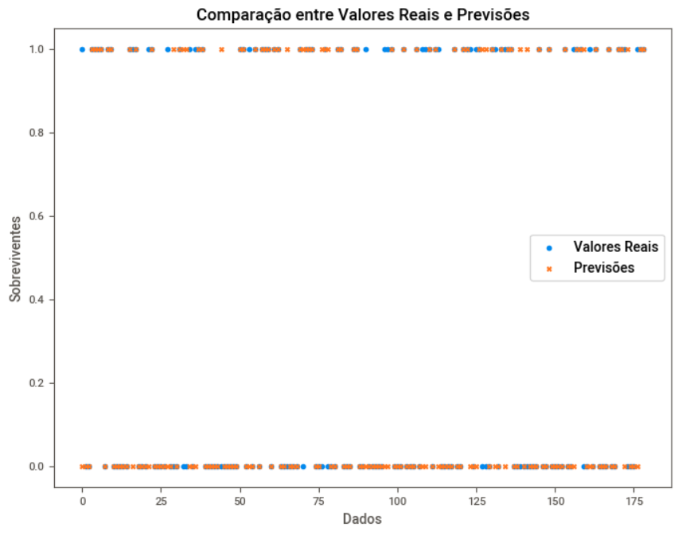
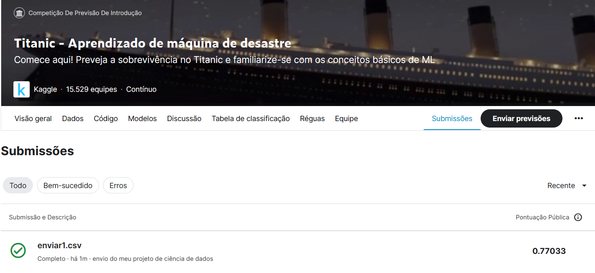

# Desafio Titanic do Kaggle - Previsão de Sobrevivência dos Passageiros



## Introdução
Este repositório contém um script em Python que tem como objetivo prever a sobrevivência dos passageiros no Titanic, como parte do desafio Kaggle "Titanic: Machine Learning from Disaster". O script utiliza análise de dados, pré-processamento de dados e modelos de aprendizado de máquina para fazer previsões e, em seguida, cria um arquivo de submissão para o Kaggle.

## Começando
- Antes de executar o script, você precisa instalar as bibliotecas necessárias. Você pode fazer isso usando o pip:

```bash
!pip install sweetviz
```
## Dados
- O conjunto de dados usado para este desafio inclui dois arquivos CSV: train.csv e test.csv. O arquivo train.csv contém os dados de treinamento com informações dos passageiros, incluindo se eles sobreviveram (a variável alvo). O arquivo test.csv contém informações dos passageiros para os quais a sobrevivência precisa ser prevista.

## Análise de Dados
- O script começa com a análise exploratória de dados usando a biblioteca sweetviz para obter insights sobre o conjunto de dados. A análise inclui visualização dos dados, suas estatísticas e muito mais. Os resultados são salvos em um relatório HTML.



## Pré-processamento de Dados
Após analisar os dados, várias etapas de pré-processamento são realizadas, incluindo:

- Tratamento de valores ausentes nos conjuntos de treinamento e teste.
- Eliminação de colunas que não são consideradas úteis para o modelo (por exemplo, "Cabin", "Name", "Ticket").
- Codificação one-hot das variáveis categóricas.
- Normalização dos dados usando o MinMaxScaler.
- Modelos de Aprendizado de Máquina
- Dois modelos de aprendizado de máquina são treinados nos dados pré-processados:

  - Classificador de Árvore de Decisão
Um Classificador de Árvore de Decisão é treinado nos dados de treinamento e usado para fazer previsões de sobrevivência.
  - Regressão Logística
Um modelo de Regressão Logística também é treinado nos dados de treinamento para prever a sobrevivência dos passageiros.

## Avaliação do Modelo
- A precisão de ambos os modelos é avaliada usando a métrica accuracy_score do scikit-learn. Os resultados são impressos no console, indicando a precisão do Classificador de Árvore de Decisão e do modelo de Regressão Logística.

## Visualização
- Matrizes de confusão são geradas para visualizar o desempenho de ambos os modelos. Gráficos de dispersão são usados para comparar os valores reais de sobrevivência com as previsões feitas pelos modelos.



## Seleção do Modelo
- Com base nas pontuações de precisão e visualizações, o modelo de Regressão Logística é selecionado, pois fornece melhores resultados neste cenário.

## Previsão nos Dados de Teste
- O modelo selecionado é então usado para prever a sobrevivência nos dados de teste. As previsões são adicionadas ao conjunto de teste e um arquivo de submissão é criado no formato necessário para a submissão no Kaggle.

## Conclusão



- Este script demonstra o processo de análise de dados, pré-processamento e seleção de modelo para o desafio Titanic do Kaggle. Ao executar o script, você pode fazer previsões e enviar seus resultados para a competição Kaggle para ver como seu modelo se sai.

Boa sorte com o seu desafio do Titanic no Kaggle!
